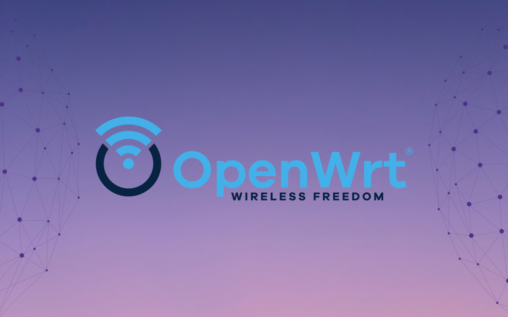

<p align="center">



</p>


<p align="center">
           
</p >

<div align="center">

[](https://visitorbadge.io/status?path=https%3A%2F%2Fgithub.com%2Fsmallprogram%2FOpenWrtAction)     [](https://github.com/smallprogram/OpenWrtAction/blob/main/LICENSE?style=flat-square)


</div>

## Source Code Information
<div align="center">

[](https://github.com/immortalwrt/immortalwrt) [](https://github.com/coolsnowwolf/lede) [](https://github.com/openwrt/openwrt)

</div>

<!--    -->


<!--   -->
<!--    -->

## WorkFlows
|ActionStatus|Network Support|Latest Release|Latest Download|
|-|-|-|-|
|[.yml/badge.svg?branch=main)](https://github.com/smallprogram/OpenWrtAction/actions/workflows/Build-OpenWrt_Multi-Platform(V3).yml)| ||[](https://github.com/smallprogram/OpenWrtAction/releases/latest)|


> 每一个Release包含多个源码平台固件，请根据自己的平台选择对应的固件下载

> 有时候可能某个Release没有你需要的固件，例如找不到X86固件，那有可能是Action中编译失败了，请耐心等待下次编译上传的Release

> 每个Release包含各个平台的packages压缩包，名称格式为buildinfo_[源码平台]_[平台名称]，例如，`buildinfo_immortalwrt_X86`,如果你不想升级固件，只想升级某个ipk可以下载压缩包选择ipk上传至软路由安装即可。

> 详细信息请参考release中的说明

<!-- |[](https://github.com/smallprogram/OpenWrtAction/actions/workflows/Build-OpenWrt_X86.yml)| |
|[](https://github.com/smallprogram/OpenWrtAction/actions/workflows/Build-OpenWrt_R5S.yml)| |
|[](https://github.com/smallprogram/OpenWrtAction/actions/workflows/Build-OpenWrt_R4S.yml)| |
|[](https://github.com/smallprogram/OpenWrtAction/actions/workflows/Build-OpenWrt_R2S.yml)| |
|[](https://github.com/smallprogram/OpenWrtAction/actions/workflows/Build-OpenWrt_R2C.yml)| |
|[](https://github.com/smallprogram/OpenWrtAction/actions/workflows/Build-OpenWrt_Pi4ModelB.yml)| | -->

[](https://star-history.com/#smallprogram/OpenWrtAction&Date)
### [English Readme](README_EN.md)

### [最新固件列表，点击自取](https://github.com/smallprogram/OpenWrtAction/tags)

### 感觉不错的话，给个Star吧

### [R1软路由安装ESXi 8.0教程](R1_ESXI8.md)

<!-- # Lean Openwrt GitHubAction


 -->
### 根据源码更新自动编译

## 相关参数
1. 默认地址:`10.10.0.253`
2. 默认账户:`root`
3. 默认密码:`无`

<!-- ## 包含内容

#### 包含各种常用插件，特殊的内容如下：

> 移除一系列下载工具

|名称|类型|简介|源码地址
-|-|-|-
|SSRP(Xray内核)|插件|Lean源码的亲儿子，评测说效率最高|https://github.com/fw876/helloworld|
|PassWall|插件|一款功能强大的科学工具|https://github.com/xiaorouji/openwrt-passwall|
|PassWall2|插件|一款功能强大的科学工具|https://github.com/xiaorouji/openwrt-passwall2|
|OpenClash|插件|配置自由度极高的科学工具|https://github.com/vernesong/OpenClash|
|DockerMan|插件|OP上玩Docker的必备插件|https://github.com/lisaac/luci-app-dockerman|
|新版argon主题|主题|十分漂亮的OP主题|https://github.com/jerrykuku/luci-theme-argon|
|Argon Config|插件|新版argon主题的设置插件|https://github.com/jerrykuku/luci-app-argon-config|
|AdguardHome|插件|屏蔽广告插件|https://github.com/rufengsuixing/luci-app-adguardhome.git|
|广告屏蔽大师Plus+|插件|屏蔽广告插件|lean code source|
|京东签到|插件|白嫖京豆插件|lean code source|
|PushPlus全能推送|插件|钉钉、企业微信推送、Bark、PushPlus各种推送|https://github.com/zzsj0928/luci-app-pushbot|
|网易云音乐Unlock|插件|周杰伦出现在网易云音乐|lean code source|
|FRP|插件|内网穿透|lean code source|
|MWAN3|插件|多线的负载均衡|lean code source|
|OpenVPN Server|服务|OpenVPN服务端|lean code source|
|PPTP VPN Server|服务|PPTP VPN服务端|lean code source|
|IPSec VPN Server|服务|IPSec VPN服务端|lean code source|
|ZeroTier|插件|内网穿透工具|lean code source|
|多线多播|插件|多线多播工具|lean code source|
|Turbo ACC|插件|网络加速器|lean code source|
|vim|工具|Linux 系统上一款文本编辑器，它是操作Linux 的一款利器|lean code source|
|nano|工具|比vi/vim要简单得多，比较适合Linux初学者使用|lean code source|
|Openssh-sftp-server|服务|sshd内置的SFTP服务器|lean code source|
|SmartDNS|服务|DNS服务|lean code source|
|MosDNS|服务|DNS服务|https://github.com/sbwml/luci-app-mosdns|
|uhttpd|服务|uhttpd server|openwrt| -->


<!-- ## config列表
|适用平台|KERNEL大小|ROOTFS大小|地址|
-|-|-|-
|||[](https://github.com/smallprogram/OpenWrtAction/blob/main/config/X86.config)|
|||[](https://github.com/smallprogram/OpenWrtAction/blob/main/config/H66K.config)|
|||[](https://github.com/smallprogram/OpenWrtAction/blob/main/config/H68K.config)|
|||[](https://github.com/smallprogram/OpenWrtAction/blob/main/config/H69K.config)|
|||[](https://github.com/smallprogram/OpenWrtAction/blob/main/config/R5S.config)|
|||[](https://github.com/smallprogram/OpenWrtAction/blob/main/config/R5C.config)|
|||[](https://github.com/smallprogram/OpenWrtAction/blob/main/config/R4S.config)|
|||[](https://github.com/smallprogram/OpenWrtAction/blob/main/config/R4SE.config)|
|||[](https://github.com/smallprogram/OpenWrtAction/blob/main/config/R2S.config)|
|||[](https://github.com/smallprogram/OpenWrtAction/blob/main/config/R2C.config)|
|||[](https://github.com/smallprogram/OpenWrtAction/blob/main/config/R66S.config)|
|||[](https://github.com/smallprogram/OpenWrtAction/blob/main/config/R68S.config)|
|||[](https://github.com/smallprogram/OpenWrtAction/blob/main/config/R_PI_3b.config)|
|||[](https://github.com/smallprogram/OpenWrtAction/blob/main/config/R_PI_4b.config)|
 -->


<!-- ## 具体功能组件相关截图：
 -->


## wsl2op.sh本地自动编译shell脚本说明

运行前请确保你的编译环境已经安装要求的编译环境，并且使用非root用户执行。

### 执行编译方式(非Root用户)

```shell
bash wsl2op.sh
```
<!-- ### 自动化编译参数
可在 `wsl2op.sh` 后加入两个可选参数：

`bash wsl2op.sh [configname] [distclean] [singleCompile]`

- `[configname]`为配置文件名称，例如`bash wsl2op.sh X86.config`,会自动默认以X86配置编译。
- `[distclean]`为启用distclean编译开关，例如`bash wsl2op.sh X86.config 1`,会自动默认以X86配置编译，并启用distclean模式。
- `[singleCompile]`为启用单线程编译开关，例如`bash wsl2op.sh X86.config 1 1`,会自动默认以X86配置和distclean模式和单线程方式进行编译

注意如果要使用`[distclean]`参数，必须要先加入`[configname]`参数，如果想不指定`[configname]`,可使用空格代替，例如`bash wsl2op.sh '' 1`,单线程编译也是如此。
如果不指定任何参数，也可以直接执行`bash wsl2op.sh`。在导航中选择即可。 -->

> 首次编译推荐使用单线程模式编译。
> 首次编译如果使用默认的多线程编译，有很大几率会编译报错。


